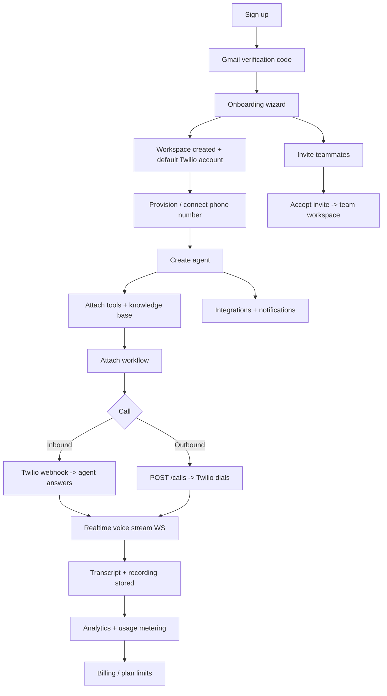

# Voicecon — End-to-End Process Flow

**Task:** [End-to-End Process flow](https://app.clickup.com/t/86eyd3kk6) (Voicecon App)
**Owner:** Sajid Ali
**Last updated:** 2026-08-03

This document describes the complete Voicecon user journey — from a first-time signup to a
completed AI voice call and its analytics — and records the verification status of every module
along the way. It is the single "whole flow" reference; the per-feature guides in [docs/](.)
cover individual subsystems in depth.

---

## 1. Scope

| | |
|---|---|
| **Goal** | Confirm every module works, and works *together*, along the real user journey |
| **Method** | Manual walkthrough on a clean account + existing automated suites |
| **Environment** | Local dev (see below) |
| **Deliverables** | This document, the test matrix (§4), and the defect log (§5) |

### Test environment

| Service | Where | Notes |
|---|---|---|
| Backend (FastAPI) | `http://localhost:8001` | `./venv/bin/uvicorn app.main:app --host 0.0.0.0 --port 8001 --reload` |
| Frontend (Next.js) | `http://localhost:3000` | `npm run dev` |
| Postgres | `localhost:5435` | Docker container `voicecon_postgres` |
| API base path | `/api/v1` | routers registered in [api.py](../backend/app/api/v1/api.py) |

> `FRONTEND_URL` in `backend/.env` must match the frontend port — it builds the links inside
> invitation and verification emails. See defect **D-001** in §5.

---

## 2. The flow at a glance

Two parallel branches hang off the main line: **team collaboration** (invite → accept → roles)
and **integrations/notifications**, which feed data outward during and after calls.

---

## 3. Stage-by-stage walkthrough

Legend: ✅ verified manually · ⏳ pending · 🔁 covered by an automated suite

### 3.1 Authentication & email verification ✅

| | |
|---|---|
| **Frontend** | [/(auth)](../frontend/src/app/(auth)) |
| **Endpoints** | `POST /auth/register`, `/auth/email/send-code`, `/auth/email/verify-code`, `/auth/login`, `/auth/refresh`, `/auth/logout`, `/auth/password/forgot`, `/auth/password/reset`, `/auth/google`, `/auth/apple`, `GET /auth/providers` |
| **Tests** | 🔁 [test_auth_api.py](../backend/tests/integration/test_auth_api.py), [test_auth_verification_api.py](../backend/tests/integration/test_auth_verification_api.py), [test_auth_service.py](../backend/tests/unit/test_auth_service.py), [auth.spec.ts](../frontend/e2e/auth.spec.ts) |

**Steps:** register with a real address → receive the 6-digit code by email → verify → land
authenticated. Password reset follows the same code path. Social login stays disabled until
`GOOGLE_CLIENT_ID` / `GOOGLE_CLIENT_SECRET` are set; `/auth/providers` reports availability.

**Expected:** unverified accounts cannot proceed; codes expire; a verified user receives access +
refresh tokens and is routed to onboarding.

**Status:** ✅ Verified manually — Sajid Ali, 2026-08-03.

---

### 3.2 Onboarding ✅

| | |
|---|---|
| **Frontend** | [/onboarding](../frontend/src/app/onboarding) |
| **Endpoints** | `GET /onboarding/status`, plus the wizard submission routes in [onboarding.py](../backend/app/api/v1/endpoints/onboarding.py) |

**Steps:** complete the wizard → workspace is created → the default Twilio account is attached so
a brand-new user can reach a working calling setup without bringing their own credentials.

**Expected:** `GET /onboarding/status` flips to complete; the dashboard becomes reachable; the
default telephony provider is present.

**Status:** ✅ Verified manually — Sajid Ali, 2026-08-03.

---

### 3.3 Team, workspaces & invitations ✅

| | |
|---|---|
| **Frontend** | [settings/team](../frontend/src/app/dashboard/settings/team), [invite/[token]](../frontend/src/app/invite/[token]), [WorkspaceSwitcher.tsx](../frontend/src/components/layout/WorkspaceSwitcher.tsx) |
| **Endpoints** | `GET/POST /team/members`, `POST /team/invite`, `GET /team/invitations`, `DELETE /team/invitations/{id}`, `PATCH /team/members/{id}`, `DELETE /team/members/{id}`, `GET /invitations/{token}`, `POST /invitations/{token}/accept`, `POST /invitations/{token}/reject`, `/workspaces/*` |
| **Tests** | 🔁 [test_invitations_api.py](../backend/tests/integration/test_invitations_api.py), [test_workspaces_api.py](../backend/tests/integration/test_workspaces_api.py), [test_permissions.py](../backend/tests/unit/test_permissions.py) |
| **Guide** | [TEAM_WORKSPACES_GUIDE.md](TEAM_WORKSPACES_GUIDE.md) |

**Steps:** owner invites by email → invitee receives the email → clicks **Accept invitation** →
joins the workspace with the assigned role → the workspace switcher lists both workspaces →
role changes and removal take effect immediately.

**Expected:** the emailed link resolves to a live invite page; tokens expire after 7 days;
role permissions are enforced server-side, not only in the UI.

**Status:** ✅ Verified manually — Sajid Ali, 2026-08-03. One defect found and fixed (**D-001**).

---

### 3.4 Phone numbers & telephony setup ✅

| | |
|---|---|
| **Frontend** | [phone-numbers](../frontend/src/app/dashboard/phone-numbers) |
| **Endpoints** | `GET /phone-numbers/providers`, `GET /phone-numbers/search`, `POST /phone-numbers/provision`, `GET/PATCH/DELETE /phone-numbers/{id}` |
| **Tests** | 🔁 [test_phone_numbers_api.py](../backend/tests/integration/test_phone_numbers_api.py), [test_number_providers.py](../backend/tests/unit/test_number_providers.py) |

**Steps:** search available numbers by country/area → provision → assign to an agent. Twilio and
Telnyx are both registered in the provider registry.

**Expected:** a provisioned number appears in the list with its webhook wired to the agent's
voice URL.

**Status:** ✅ Verified manually — Sajid Ali, 2026-08-03.

---

### 3.5 Agents ✅

| | |
|---|---|
| **Frontend** | [agents](../frontend/src/app/dashboard/agents) |
| **Endpoints** | `POST/GET /agents`, `GET/PATCH/DELETE /agents/{id}`, `POST /agents/{id}/clone`, `POST /agents/{id}/test`, `POST /agents/{id}/speak` |
| **Tests** | 🔁 [test_agent_api.py](../backend/tests/integration/test_agent_api.py), [test_agent_service.py](../backend/tests/unit/test_agent_service.py), [agent-creation.spec.ts](../frontend/e2e/agent-creation.spec.ts) |

**Steps:** create an agent (prompt, voice, model) → test it in the builder → clone → edit → delete.

**Status:** ✅ Verified manually — Sajid Ali, 2026-08-03.

---

### 3.6 Tools ✅

| | |
|---|---|
| **Frontend** | [tools](../frontend/src/app/dashboard/tools) |
| **Endpoints** | `POST/GET /tools`, `GET/PATCH/DELETE /tools/{id}`, `POST /tools/{id}/test`, `GET /tools/agents/{agent_id}/tools`, `POST/DELETE /tools/agents/{agent_id}/tools/{tool_id}` |
| **Tests** | 🔁 [test_agent_tool_chain.py](../backend/tests/unit/test_agent_tool_chain.py) |

**Steps:** define a tool → test it standalone → attach to an agent → confirm the agent can call it.

**Status:** ✅ Verified manually — Sajid Ali, 2026-08-03.
**Note:** tool execution *during a live call* is part of the pending call test (§3.10).

---

### 3.7 Knowledge base ✅

| | |
|---|---|
| **Frontend** | [knowledge](../frontend/src/app/dashboard/knowledge) |
| **Endpoints** | `POST/GET /knowledge-bases`, `GET/DELETE /knowledge-bases/{id}`, `POST /documents`, `POST /documents/upload`, `GET /knowledge-bases/{id}/documents`, `GET /documents/{id}/download` |
| **Guide** | [RAG_KNOWLEDGE_BASE_GUIDE.md](RAG_KNOWLEDGE_BASE_GUIDE.md) |

**Steps:** create a KB → upload documents → confirm indexing → attach to an agent → confirm
retrieval in agent responses.

**Status:** ✅ Verified manually — Sajid Ali, 2026-08-03.

---

### 3.8 Integrations ✅

| | |
|---|---|
| **Frontend** | [integrations](../frontend/src/app/dashboard/integrations) |
| **Endpoints** | `GET /integrations`, `GET /integrations/connectors`, `POST /integrations/oauth/authorize`, `/oauth/callback`, `/oauth/refresh`, `POST/GET /integrations/connections` |
| **Tests** | 🔁 [test_integration_api.py](../backend/tests/integration/test_integration_api.py), [test_integration_services.py](../backend/tests/unit/test_integration_services.py), [integration-workflow.spec.ts](../frontend/e2e/integration-workflow.spec.ts) |

**Steps:** browse connectors → OAuth authorize → callback stores the connection → token refresh →
data flows on trigger.

**Status:** ✅ Verified manually — Sajid Ali, 2026-08-03.

---

### 3.9 Notifications, chat widget, API keys, user settings ✅

| Module | Endpoints | Status |
|---|---|---|
| Notifications | `GET /notifications`, `/unread-count`, `POST /{id}/read`, `/read-all` | ✅ 2026-08-03 |
| Chat widget | `GET /chat/public/{key}/config`, `POST /chat/public/{key}/message`, `GET /chat/widget.js` | ✅ 2026-08-03 |
| API keys | `GET /api-keys/scopes`, `POST/GET /api-keys`, `PATCH /{id}`, `POST /{id}/regenerate`, `DELETE /{id}` | ✅ 2026-08-03 |
| User settings | `GET/PATCH /users/me`, `POST /users/me/change-password`, `DELETE /users/me` | ✅ 2026-08-03 |

🔁 [test_chat_widget.py](../backend/tests/unit/test_chat_widget.py), [test_settings_api.py](../backend/tests/integration/test_settings_api.py)

---

### 3.10 Calls — inbound & outbound ⏳ **PENDING — highest priority**

| | |
|---|---|
| **Frontend** | [calls](../frontend/src/app/dashboard/calls) |
| **Endpoints** | `POST /calls`, `GET /calls`, `GET /calls/stats`, `GET /calls/{id}`, `DELETE /calls/{id}`, `GET /calls/contacts`, `WS /calls/ws/{agent_id}` |
| **Webhooks** | `POST /telephony/twilio/voice/{agent_id}` (inbound), `POST /telephony/twilio/status`, `POST /telephony/twilio/voice-outbound`, `GET /telephony/twilio/call/{sid}/details`, plus the Telnyx equivalents |
| **Voice stream** | `WS /voice/stream/{call_id}`, `GET /voice/sessions/active`, `GET /voice/sessions/{call_id}` |
| **Tests** | 🔁 [test_call_api.py](../backend/tests/integration/test_call_api.py), [test_call_manager.py](../backend/tests/unit/test_call_manager.py), [test_voice_roundtrip.py](../backend/tests/unit/test_voice_roundtrip.py), [test_twilio_webhook_validation.py](../backend/tests/unit/test_twilio_webhook_validation.py), [call-flow.spec.ts](../frontend/e2e/call-flow.spec.ts) |
| **Guide** | [TWILIO_SETUP_AND_TESTING.md](TWILIO_SETUP_AND_TESTING.md) |

**To test — inbound:**
1. Call the provisioned number from a real phone.
2. Agent answers; hold a short conversation covering a tool call and a knowledge-base question.
3. Hang up; confirm the call row appears with correct duration and status.
4. Confirm the transcript is complete and the recording plays back.

**To test — outbound:**
1. `POST /calls` (or trigger from the UI) to your own phone.
2. Confirm ringing, agent speech, barge-in/interruption handling, and clean teardown.
3. Confirm the status webhook updates the record to `completed`.

**Expected:** every call produces a stored record, a transcript, a recording, and a usage entry
that reaches analytics and billing.

**Status:** ⏳ Pending. This is the core product path and the one stage that cannot be inferred
from the setup modules being green.

---

### 3.11 Workflows ⏳ **PENDING**

| | |
|---|---|
| **Frontend** | [workflows](../frontend/src/app/dashboard/workflows) |
| **Endpoints** | `POST/GET /workflows`, `GET/PATCH/DELETE /workflows/{id}`, `POST /{id}/execute`, `GET /{id}/executions`, `GET /{id}/executions/{execution_id}`, `GET /{id}/stats`, `POST /{id}/validate`, `POST /{id}/test-trigger`, `WS /{id}/executions/stream`, `POST /trigger/voice-event`, `POST /trigger/integration-event`, `POST /workflows/webhook/{key}` |
| **Tests** | 🔁 [test_workflow_dag.py](../backend/tests/unit/test_workflow_dag.py), [test_workflow_graph.py](../backend/tests/unit/test_workflow_graph.py), [test_workflow_advanced.py](../backend/tests/unit/test_workflow_advanced.py), [test_workflow_phase0.py](../backend/tests/unit/test_workflow_phase0.py), [test_voice_to_workflow.py](../backend/tests/unit/test_voice_to_workflow.py) |
| **Guides** | [WORKFLOW_SYSTEM_GUIDE.md](WORKFLOW_SYSTEM_GUIDE.md), [WORKFLOW_TRIGGERS_GUIDE.md](WORKFLOW_TRIGGERS_GUIDE.md), [VOICE_TO_WORKFLOW_GUIDE.md](VOICE_TO_WORKFLOW_GUIDE.md) |

**To test:** build a workflow in the builder → validate → execute manually → check the execution
log and the live execution stream → fire it from a voice event during a real call → fire it from
an integration event → fire it from the public webhook.

**Status:** ⏳ Pending. Test after §3.10, since the voice-event trigger depends on a live call.

---

### 3.12 Analytics ⏳ **PENDING**

| | |
|---|---|
| **Frontend** | [analytics](../frontend/src/app/dashboard/analytics) |
| **Endpoints** | `GET /analytics/call-metrics`, `/agent-metrics/{id}`, `/integration-metrics/{id}`, `/daily-summary`, `/realtime`, `/dashboard`, `POST /analytics/aggregate` |
| **Guides** | [ANALYTICS_SYSTEM_GUIDE.md](ANALYTICS_SYSTEM_GUIDE.md), [ANALYTICS_SCHEDULER_GUIDE.md](ANALYTICS_SCHEDULER_GUIDE.md) |

**To test:** after the calls in §3.10, confirm the call appears in real-time metrics, the daily
summary aggregates correctly, and per-agent metrics match the actual call count and duration.

**Status:** ⏳ Pending — depends on §3.10 producing real data.

---

### 3.13 Billing ⏳ **PENDING**

| | |
|---|---|
| **Endpoints** | `GET /billing/plans`, `GET /billing/config`, `GET/POST/PUT/DELETE /billing/subscription`, `GET /billing/usage`, `/usage/limits`, `/invoices`, `POST /billing/webhooks/stripe` |
| **Tests** | 🔁 [test_billing_api.py](../backend/tests/integration/test_billing_api.py), [test_billing_service.py](../backend/tests/unit/test_billing_service.py) |
| **Guide** | [STRIPE_BILLING_GUIDE.md](STRIPE_BILLING_GUIDE.md) |

**To test:** list plans → subscribe in Stripe test mode → confirm the webhook activates the
subscription → confirm call usage decrements the quota → confirm limits block usage at zero →
cancel and confirm downgrade.

**Status:** ⏳ Pending.

---

### 3.14 Marketplace / templates ⏳ **PENDING**

| | |
|---|---|
| **Frontend** | [marketplace](../frontend/src/app/dashboard/marketplace) |
| **Endpoints** | `GET /marketplace/templates/agents`, `/templates/agents/{slug}`, `/templates/workflows`, `/templates/agents/{slug}/reviews`, `/categories`, `GET /marketplace/my-installations`, plus install/review POSTs |
| **Guide** | [TEMPLATE_MARKETPLACE_GUIDE.md](TEMPLATE_MARKETPLACE_GUIDE.md) |

**To test:** browse templates → install an agent template → confirm it appears as a working agent
→ install a workflow template → leave a review → check `my-installations`.

**Status:** ⏳ Pending.

---

## 4. Test matrix

| # | Module | Manual | Automated | Status |
|---|---|---|---|---|
| 1 | Auth + email verification | ✅ 2026-08-03 | ✅ | Pass |
| 2 | Onboarding + default Twilio | ✅ 2026-08-03 | — | Pass |
| 3 | Team / workspaces / invitations | ✅ 2026-08-03 | ✅ | Pass (1 defect fixed) |
| 4 | Phone numbers | ✅ 2026-08-03 | ✅ | Pass |
| 5 | Agents | ✅ 2026-08-03 | ✅ | Pass |
| 6 | Tools | ✅ 2026-08-03 | ✅ | Pass |
| 7 | Knowledge base | ✅ 2026-08-03 | — | Pass |
| 8 | Integrations | ✅ 2026-08-03 | ✅ | Pass |
| 9 | Notifications | ✅ 2026-08-03 | — | Pass |
| 10 | Chat widget | ✅ 2026-08-03 | ✅ | Pass |
| 11 | API keys | ✅ 2026-08-03 | — | Pass |
| 12 | User settings | ✅ 2026-08-03 | ✅ | Pass |
| 13 | **Calls (inbound + outbound)** | ⏳ | ✅ | **Pending** |
| 14 | **Workflows** | ⏳ | ✅ | **Pending** |
| 15 | **Analytics** | ⏳ | — | **Pending** |
| 16 | **Billing** | ⏳ | ✅ | **Pending** |
| 17 | **Marketplace** | ⏳ | — | **Pending** |

**12 of 17 modules verified.** The five pending items are the runtime half of the product:
a call happening, a workflow firing from it, and the metering/reporting that follows.

---

## 5. Defect log

| ID | Module | Severity | Description | Status |
|---|---|---|---|---|
| D-001 | Invitations / email | High | Invitation emails linked to `http://localhost:3002/invite/{token}` while the frontend runs on port 3000, so **Accept invitation** landed on `ERR_CONNECTION_REFUSED`. Cause: stale `FRONTEND_URL` in `backend/.env`, used by [invitation_service.py:31](../backend/app/services/team/invitation_service.py#L31). The same value also backs the Google OAuth redirect. | ✅ Fixed 2026-08-03 (`FRONTEND_URL=http://localhost:3000`; backend restart required) |

> D-001 is a good illustration of why this task exists: the invitation module passed every in-app
> check, and the failure only appeared once the flow crossed into email and back.

---

## 6. Remaining work

1. **Calls (§3.10)** — one inbound and one outbound call, end to end, with transcript and recording.
2. **Workflows (§3.11)** — manual execution plus a voice-event trigger during the call above.
3. **Analytics (§3.12)** — confirm the call from step 1 surfaces correctly in the metrics.
4. **Billing (§3.13)** — Stripe test-mode subscription, usage metering, limit enforcement.
5. **Marketplace (§3.14)** — install one agent template and one workflow template.
6. Run the full automated suites and attach the output:
   - `cd backend && ./venv/bin/python -m pytest tests/ -p no:postgresql -o addopts="" -W ignore::DeprecationWarning`
   - `cd frontend && npx playwright test`
7. Attach screenshots per stage and file any new defects in §5.

---

## 7. Sign-off

| | |
|---|---|
| Tested by | Sajid Ali |
| Reviewed by | _pending_ |
| Date | 2026-08-03 |
| Result | 12/17 modules verified; 5 pending; 1 defect found and fixed |
